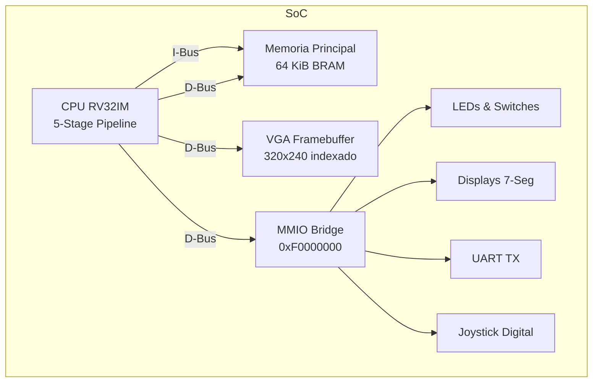

# CPU RISC-V en VHDL para DE10-Lite (FPGA Intel MAX 10)

Un procesador RISC-V (RV32IM) de 32 bits diseñado desde cero en VHDL, con segmentación (pipeline) de 5 etapas y un System-on-Chip (SoC) completo. El SoC incluye memoria BRAM, controlador VGA con paleta de colores, puerto UART, controlador de displays de 7 segmentos y soporte para un **joystick digital** vía pines de Arduino.

Actualmente, el procesador ejecuta de forma nativa (bare-metal) un **juego de Snake en C**, renderizado directamente en la pantalla VGA y controlado por hardware.

---

## 🏗 Arquitectura del Sistema

El SoC interconecta la CPU con la memoria y los periféricos mediante un bus de datos mapeado en memoria (MMIO).



### Características del Core (Pipeline de 5 Etapas)

- **ISA**: RV32IM (Extensiones Base Entera + Multiplicación/División). Sin compresión (RVC), sin soporte de coma flotante.
- **Segmentación**: 5 etapas clásicas (`IF` -> `ID` -> `EX` -> `MEM` -> `WB`). Predicción de saltos estática (Not-Taken).
- **Hazard Unit**: Resolución automática de riesgos de datos (Data Hazards) mediante *forwarding* transparente desde EX/MEM y MEM/WB. Detección inteligente de *load-use stalls*.
- **Instruction Fetch Buffer**: Mecanismo avanzado de sincronización introducido en la etapa IF para prevenir la caída (*drop*) y pérdida de instrucciones debida a bloqueos combinacionales del pipeline (operaciones multi-ciclo o stalls espurios) y a la latencia de 1 ciclo inherente a la memoria BRAM síncrona.
- **Unidad ALU/M**: Multiplicador de hardware de 33x33 mapeado a bloques DSP nativos de la FPGA (2 ciclos) y divisor iterativo de restauración por hardware (~34 ciclos) que soporta sin fisuras los casos excepcionales del estándar RISC-V.
- **CSR**: Registros de estado orientados a Machine-Mode (`mstatus`, `mepc`, `mcause`, `mcycle` operando como un timer de altísima precisión para físicas de juego).

---

## 🗺 Mapa de Memoria

El bus del SoC decodifica las direcciones generadas por la CPU para comunicarse con la memoria física y los periféricos. Se utiliza conversión de Word/Byte (alineamiento) para las memorias internas.

| Rango de Memoria            | Tamaño   | Función                                  |
|-----------------------------|----------|------------------------------------------|
| `0x0000_0000 - 0x0000_FFFF` | 64 KiB   | RAM principal (Código C + Datos + Pila)  |
| `0x1000_0000 - 0x1001_2BFF` | 75 KiB   | Framebuffer VGA (320x240 px, 4 bpp)      |
| `0xF000_0000 - 0xF000_00FF` | 256 B    | Periferia MMIO                           |

### Mapa Detallado MMIO (`0xF000_0000`)

| Offset | R/W | Periférico                                   |
|--------|-----|----------------------------------------------|
| `0x00` | W   | **LEDR**: 10 LEDs rojos de la placa          |
| `0x04` | R   | **SWITCHES**: Lectura de los 10 interruptores|
| `0x08` | R   | **KEYS**: Botones KEY1 y KEY0 (Reset)        |
| `0x0C` | W   | **HEX**: Control de los 6 displays de 7-seg  |
| `0x10` | W   | **UART_TX**: Transmisión de bytes (115200)   |
| `0x14` | R   | **UART_STATUS**: Estado (Bit 0 = Busy)       |
| `0x18` | R   | **TIMER**: Contador de ciclos libres a 50 MHz|
| `0x1C` | R   | **JOYSTICK**: Estado direccional activo en 0 |
| `0x20` | W   | **PALETTE**: Base de 16 colores xRGB 12 bits |

---

## 🎮 Integración del Joystick (Arduino Headers)

El SoC cuenta con mapeo directo para un joystick digital, conectado a los pines de expansión Arduino de la placa Terasic DE10-Lite (`ARDUINO_IO[8]` a `ARDUINO_IO[14]`). 
Los pines del joystick tienen habilitadas las resistencias de *pull-up* internas en el hardware (`WEAK_PULL_UP_RESISTOR ON` en Quartus), por lo que el común del joystick debe operar derivando a tierra (GND) para generar lógica direccional **activa en baja (Active-Low)**.

**Pinout Físico del Joystick:**
- `IO08` (PIN_AB17): **RST**
- `IO09` (PIN_AA17): **SET**
- `IO10` (PIN_AB19): **MID**
- `IO11` (PIN_AA19): **RIGHT** (Derecha)
- `IO12` (PIN_Y19) : **LEFT** (Izquierda)
- `IO13` (PIN_AB20): **DOWN** (Abajo)
- `IO14` (PIN_AB21): **UP** (Arriba)

*Nota: La salida física UART TX ha sido reubicada y reconfigurada en el pin Arduino `IO01` (PIN_AB6) para cumplir el estándar de placas y no colisionar con el header de expansión de los periféricos de juego.*

---

## 🐍 Firmware: Juego de Snake en C

En el directorio `firmware/` se incluye el código fuente completo en lenguaje C del clásico juego **Snake**. El software es un ejecutable bare-metal nativo que invoca las direcciones del hardware MMIO mediante la cabecera `soc.h` para:
1. **Renderizado de gráficos**: Se comunica con el Framebuffer VGA mapeado en `0x10000000`.
2. **Pintado de pantalla**: Modifica dinámicamente la paleta de colores nativa HSL del procesador.
3. **Control**: Lee de manera fluida y en tiempo real las entradas Active-Low del `JOYSTICK` para rotar la serpiente.
4. **Lógica de Generación Pseudo-Aleatoria (RNG)**: Produce coordenadas pseudo-aleatorias para posicionar la manzana, valiéndose del módulo `TIMER` del SoC de 50 MHz.
5. **HUD Físico**: Muestra y actualiza la longitud de la serpiente (puntuación) simultáneamente a través de los displays HEX de la placa, aprovechando el bus de datos en la etapa Write-Back de la CPU.

### 🛠 Cómo Compilar el Firmware C

Necesitas tener instalada la *toolchain* de RISC-V (`riscv64-unknown-elf-gcc` o `riscv32-unknown-elf-gcc`). En sistemas Windows, se recomienda utilizar el entorno Bash de Ubuntu mediante **WSL**.

```bash
cd firmware
make
```
El comando `make` automatizará el proceso de compilación, generará el binario enlazado (`.elf`), lo reducirá con formato binario y por último ejecutará un script de Python que generará el archivo `program.mif`. Este archivo de inicialización `.mif` (Memory Initialization File) será consumido por Quartus en la fase de síntesis para grabar permanentemente el software precompilado en el silicio (memoria Flash BRAM) del procesador SoC.

### 🔌 Síntesis y Flasheo en Quartus

1. Abre el proyecto `CPU-RISC-V.qpf` en el IDE **Intel Quartus Prime**.
2. Presiona **Start Compilation** para compilar toda la estructura jerárquica de archivos VHDL, sintetizar el flujo del pipeline en elementos lógicos e integrar el firmware binario de Snake (`.mif`) dentro del archivo programable final `.sof`.
3. Una vez termine, despliega la herramienta **Programmer** de Quartus.
4. Conecta tu FPGA Terasic DE10-Lite por el conector USB-Blaster.
5. Flashea el diseño y... ¡A jugar!
